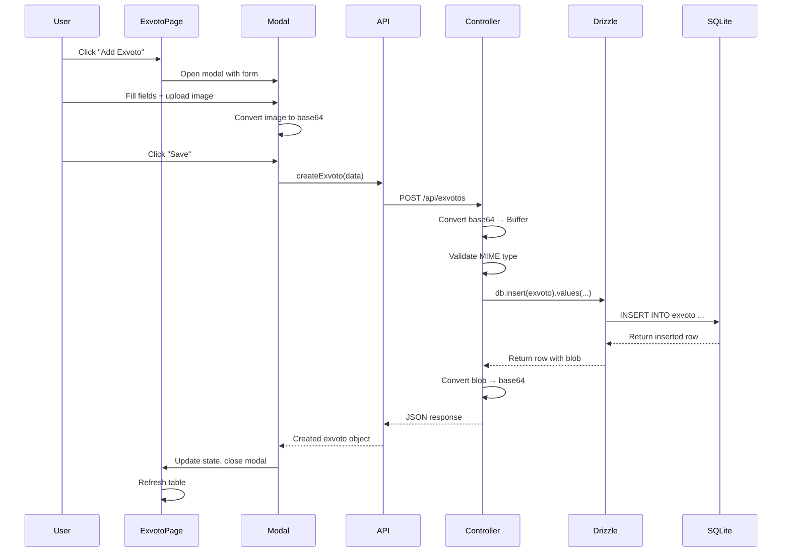
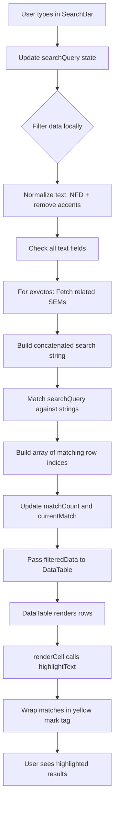
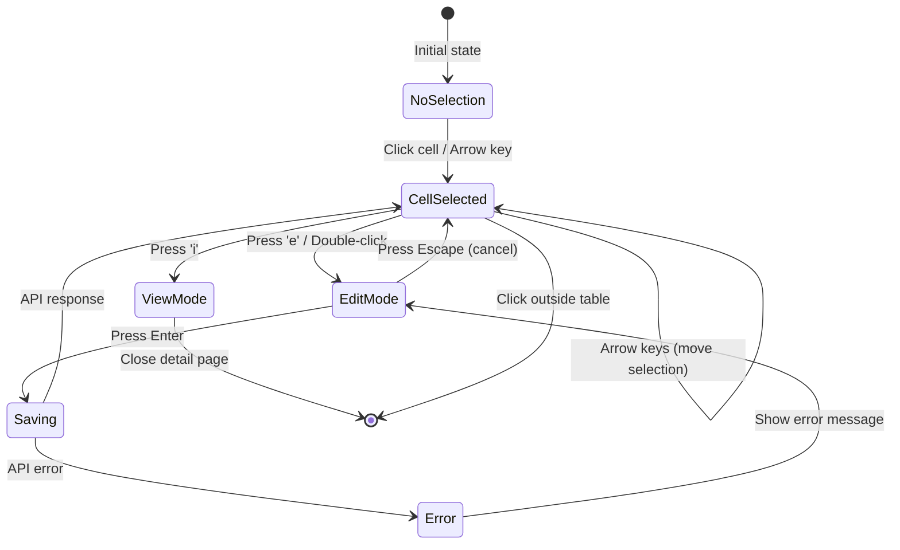

# ExvoRed System Architecture

## System Overview

ExvoRed is a specialized web application for managing and cataloging **exvotos** (votive offerings) - religious artifacts offered in gratitude for miracles. The system provides a comprehensive database for tracking exvotos, their associated sanctuaries/shrines/museums (SEMs), catalogs, divinities, characters, and miracle types.

The application is designed for academic research and cataloging workflows, featuring Excel-like table navigation, advanced search capabilities, and extensive relationship management between entities. The system supports image storage, flexible date handling (including partial dates with unknown components), and multi-table cross-referencing.

**Core Domain Entities:**
- **Exvoto**: Votive offerings with detailed metadata (date, location, transcription, material, etc.)
- **SEM** (Santuario/Ermita/Museo): Physical locations where exvotos are offered or conserved
- **Catalog**: Published academic catalogs documenting exvotos
- **Divinity**: Religious figures (Virgins, Saints) associated with exvotos and SEMs
- **Character**: Personas represented in exvotos
- **Miracle**: Types of miracles documented in exvotos

---

## Technology Stack

### Frontend

**Core Technologies:**
- **React 19**: Modern React with hooks and concurrent features
- **TypeScript**: Type-safe development with strict null checks
- **Vite**: Fast build tool and development server (default port 5173)
- **React Router 6**: Client-side routing with lazy loading
- **Tailwind CSS**: Utility-first styling framework

**UI Components:**
- **Heroicons**: Icon library for React
- **Custom Components**: DataTable, SearchBar, Modal, Layout, EpochSelector

**Key Libraries:**
- `clsx` + `tailwind-merge`: Dynamic class composition
- React lazy loading: Code splitting for route components

### Backend

**Core Technologies:**
- **Node.js**: JavaScript runtime
- **Express 5**: Web framework for RESTful API
- **TypeScript**: Compiled to ES modules
- **tsx**: TypeScript execution for development

**API Configuration:**
- Port: 3000 (default)
- CORS enabled for development (localhost:5173)
- JSON payload limit: 10MB (for base64 image uploads)

### Database

**Database Engine:**
- **SQLite**: Embedded relational database stored as `api/db/database.db`
- File-based, zero-configuration
- ACID-compliant transactions
- Supports blob storage for images

**ORM:**
- **Drizzle ORM 0.44.2**: Type-safe SQL query builder
- Schema-first design pattern
- Type inference from schema definitions (`$inferSelect`, `$inferInsert`)
- Migration generation via `drizzle-kit`

**Database Tools:**
- **Drizzle Studio**: Web-based database inspector
- **better-sqlite3**: Fast synchronous SQLite driver

---

## Architecture Patterns

### 1. Client-Server Separation

**Three-Tier Architecture:**
```
┌─────────────────────────────────────┐
│   Presentation Layer (React SPA)    │
│   - Components, Pages, Hooks        │
│   - State Management (React State)  │
│   - Routing (React Router)          │
└─────────────┬───────────────────────┘
              │ HTTP/JSON (REST)
┌─────────────▼───────────────────────┐
│   Application Layer (Express API)   │
│   - Controllers, Routes, Business   │
│   - Image Processing, Validation    │
└─────────────┬───────────────────────┘
              │ SQL (Drizzle ORM)
┌─────────────▼───────────────────────┐
│   Data Layer (SQLite)               │
│   - Tables, Relations, Indexes      │
│   - Blob Storage for Images         │
└─────────────────────────────────────┘
```

**Separation Benefits:**
- Independent deployment of frontend and backend
- Clear API contract between layers
- Frontend can be built statically for CDN hosting
- Backend can scale independently

### 2. RESTful API Design

**Endpoint Pattern:** `/api/{entity}[/{id}][/{sub-resource}]`

**Standard CRUD Operations:**
- `GET /api/{entity}` - List all records
- `GET /api/{entity}/:id` - Retrieve single record
- `POST /api/{entity}` - Create new record
- `PUT /api/{entity}/:id` - Update existing record
- `DELETE /api/{entity}/:id` - Delete record

**Sub-resource Pattern (Images):**
- `POST /api/exvotos/:id/images` - Add images to exvoto
- `GET /api/exvotos/:id/images` - List exvoto images
- `DELETE /api/exvotos/:id/images/:imageId` - Remove image

**Junction Table Management:**
- `GET /api/catalog-sems` - List all catalog-SEM associations
- `POST /api/catalog-sems` - Create association
- `DELETE /api/catalog-sems/:catalogId/:semId` - Remove association

### 3. ORM-Based Data Access

**Drizzle ORM Architecture:**
```typescript
// Schema definition (source of truth)
api/db/schema.ts
  → Type inference → Backend types
  → Migration generation → SQL migrations
  → Query building → Type-safe queries

// Controller pattern
Controller → Drizzle Query Builder → SQLite
```

**Schema-First Workflow:**
1. Define/modify schema in `api/db/schema.ts`
2. Run `npm run db:push` (dev) or `npm run db:generate` + `npm run db:migrate` (prod)
3. Types automatically inferred via `typeof table.$inferSelect`
4. Frontend types in `src/types.ts` mirror backend types

**Relationship Patterns:**
- **One-to-Many**: `exvoto.offering_sem_id → sem.id` (via foreign key)
- **Many-to-Many**: `catalog ↔ catalog_exvoto ↔ exvoto` (via junction table)
- **Self-Referential**: Exvoto has three SEM references (offering, conservation, origin)

### 4. Component-Based UI Architecture

**Component Hierarchy:**
```
App (Router)
└── Layout (Navigation, Global State)
    └── Suspense (Loading Boundary)
        └── ErrorBoundary (Error Handling)
            └── Page Components (Lazy Loaded)
                ├── DataTable (Reusable Grid)
                ├── SearchBar (Search + Highlighting)
                ├── Modal (Forms, Dialogs)
                └── Domain-Specific Components
```

**Component Responsibilities:**
- **Layout**: Navigation sidebar, global shortcuts, consistent structure
- **DataTable**: Excel-like grid with inline editing, sorting, column management
- **SearchBar**: Real-time search, accent-insensitive matching, result navigation
- **Modal**: Reusable dialog container for forms and detail views
- **Pages**: Entity-specific logic, data fetching, CRUD operations

---

## Component Architecture

### Frontend Structure

```
/src/
├── App.tsx                      # React Router setup, lazy loading
├── main.tsx                     # Application entry point
├── types.ts                     # TypeScript type definitions
├── index.css                    # Tailwind directives
│
├── /components/                 # Reusable UI components
│   ├── Layout.tsx               # App shell with navigation
│   ├── DataTable.tsx            # Excel-like table with inline edit
│   ├── SearchBar.tsx            # Advanced search with highlighting
│   ├── Modal.tsx                # Dialog container
│   ├── EpochSelector.tsx        # 25-year epoch selector (XIII-XXI)
│   ├── ErrorBoundary.tsx        # Error catching boundary
│   ├── TagSelect.tsx            # Multi-select tag component
│   └── icons.tsx                # Heroicon wrappers
│
├── /pages/                      # Route components (lazy loaded)
│   ├── ExvotoPage.tsx           # Exvoto list view
│   ├── ExvotoDetailPage.tsx    # Exvoto detail/edit view
│   ├── SemPage.tsx              # SEM list view
│   ├── SemDetailPage.tsx        # SEM detail/edit view
│   ├── CatalogPage.tsx          # Catalog list view
│   ├── CatalogDetailPage.tsx   # Catalog detail/edit view
│   ├── DivinitiesPage.tsx      # Divinity list view
│   ├── CharactersPage.tsx      # Character management
│   ├── MiraclesPage.tsx        # Miracle management
│   └── KeybindsPage.tsx        # Keyboard shortcuts documentation
│
├── /services/
│   └── api.ts                   # Centralized API client functions
│
├── /hooks/                      # Custom React hooks
│   ├── useExcelMode.ts          # Excel-like table state management
│   ├── useExcelKeyboard.ts      # Arrow key navigation
│   └── useGlobalShortcut.ts     # Global keyboard shortcuts
│
└── /utils/                      # Utility functions
    ├── highlightText.tsx        # Search result highlighting
    ├── epochUtils.ts            # 25-year epoch calculation
    └── images.ts                # Image encoding/decoding
```

### Backend Structure

```
/api/
├── server.ts                    # Express server setup, CORS, routes
│
├── /db/
│   ├── schema.ts                # Drizzle ORM schema (source of truth)
│   ├── index.ts                 # Database connection setup
│   ├── seed.ts                  # Sample data population
│   ├── database.db              # SQLite database file
│   └── /migrations/             # Auto-generated SQL migrations
│
├── /controllers/                # Business logic layer
│   ├── exvotoController.ts      # Exvoto CRUD + image handling
│   ├── semController.ts         # SEM CRUD
│   ├── catalogController.ts     # Catalog CRUD
│   ├── divinityController.ts   # Divinity CRUD
│   ├── characterController.ts  # Character CRUD
│   ├── miracleController.ts    # Miracle CRUD
│   └── catalogSemController.ts # Junction table management
│
└── /routes/                     # Express route definitions
    ├── exvotoRoutes.ts          # Mount exvoto endpoints
    ├── semRoutes.ts             # Mount SEM endpoints
    ├── catalogRoutes.ts         # Mount catalog endpoints
    ├── divinityRoutes.ts        # Mount divinity endpoints
    ├── characterRoutes.ts       # Mount character endpoints
    ├── miracleRoutes.ts         # Mount miracle endpoints
    └── catalogSemRoutes.ts      # Mount catalog-SEM endpoints
```

### Database Schema

**Core Tables:**
- `exvoto` - Main entity with 30+ fields (dates, locations, transcription, etc.)
- `sem` - Sanctuaries with location, festivity, exvoto counts
- `catalog` - Publications with author, year, location description
- `divinity` - Divinities with attributes, history, representation
- `character` - Simple name catalog for personas
- `miracle` - Simple name catalog for miracle types
- `exvoto_image` - Multiple images per exvoto (one-to-many)

**Junction Tables:**
- `catalog_exvoto` - Links catalogs ↔ exvotos (many-to-many)
- `catalog_sem` - Links catalogs ↔ SEMs (many-to-many)
- `divinity_sem` - Links divinities ↔ SEMs (many-to-many)

**Relationship Diagram:**
```
┌──────────┐       ┌─────────────────┐       ┌─────────┐
│ catalog  │──────>│ catalog_exvoto  │<──────│ exvoto  │
└──────────┘       └─────────────────┘       └─────────┘
     │                                             │
     │             ┌─────────────────┐             │ offering_sem_id
     └────────────>│  catalog_sem    │             │ conservation_sem_id
                   └─────────────────┘             ▼
                            │                 ┌─────────┐
                            ▼                 │   sem   │
                       ┌─────────┐            └─────────┘
                       │   sem   │                 ▲
                       └─────────┘                 │
                            ▲                      │
                            │                      │
                   ┌─────────────────┐             │
                   │  divinity_sem   │             │
                   └─────────────────┘             │
                            │                      │
                            ▼                      │
                       ┌──────────┐                │
                       │ divinity │                │
                       └──────────┘                │
                                                   │
                                          ┌────────┴───────┐
                                          │ exvoto_image   │
                                          └────────────────┘
```

---

## Data Flow

### 1. Read Operation (GET)

```
┌─────────────────────────────────────────────────────────────────┐
│                      LIST EXVOTOS FLOW                           │
└─────────────────────────────────────────────────────────────────┘

User navigates to /exvotos
         │
         ▼
React Router loads ExvotoPage.tsx (lazy)
         │
         ▼
useEffect hook calls getExvotos() from api.ts
         │
         ▼
Fetch: GET http://localhost:3000/api/exvotos
         │
         ▼
Express routes to exvotoController.getAll()
         │
         ▼
Controller: db.select().from(exvoto)
         │
         ▼
Drizzle ORM generates SQL: SELECT * FROM exvoto
         │
         ▼
SQLite returns rows with blob images
         │
         ▼
Controller converts images: blob → base64 data URL
         │
         ▼
Response: JSON array with data URLs
         │
         ▼
Frontend: setState with exvoto array
         │
         ▼
DataTable renders rows, SearchBar enables filtering
```

### 2. Write Operation (POST/PUT)

```
┌─────────────────────────────────────────────────────────────────┐
│                     CREATE EXVOTO FLOW                           │
└─────────────────────────────────────────────────────────────────┘

User clicks "Add Exvoto" button
         │
         ▼
Modal opens with form inputs
         │
         ▼
User fills fields, uploads image (file input)
         │
         ▼
Image converted: File → base64 data URL (in browser)
         │
         ▼
Form submission calls createExvoto(data) from api.ts
         │
         ▼
Fetch: POST http://localhost:3000/api/exvotos
Body: { ...fields, image: "data:image/jpeg;base64,..." }
         │
         ▼
Express routes to exvotoController.create()
         │
         ▼
Controller converts image: data URL → Buffer
Controller validates MIME type (JPEG/PNG only)
         │
         ▼
Controller: db.insert(exvoto).values({ ...data, image: buffer })
         │
         ▼
Drizzle ORM generates SQL: INSERT INTO exvoto VALUES (...)
         │
         ▼
SQLite stores blob, returns inserted row
         │
         ▼
Controller converts image back: blob → base64 data URL
         │
         ▼
Response: JSON object with created exvoto
         │
         ▼
Frontend: Update state, close modal, refresh table
```

### 3. Image Handling Flow

**Upload Path:**
```
File Input (frontend)
    → FileReader.readAsDataURL()
    → base64 string: "data:image/jpeg;base64,/9j/4AAQ..."
    → JSON.stringify() in POST body
    → Express JSON parser (10MB limit)
    → Controller: toBuffer() extracts base64
    → Buffer stored as blob in SQLite
```

**Retrieval Path:**
```
SQLite returns blob (Buffer/Uint8Array)
    → Controller: detectMimeType() via magic bytes
    → bufferToDataUrl() creates data URL
    → JSON response to frontend
    →  renders directly
```

**Why This Approach:**
- **Simplicity**: No file system management, no CDN configuration
- **Portability**: Database file contains everything
- **Transactional**: Images deleted atomically with parent records
- **Limitation**: 10MB limit per request, not suitable for very large images

### 4. Search and Filtering Flow

```
┌─────────────────────────────────────────────────────────────────┐
│                      SEARCH FLOW                                 │
└─────────────────────────────────────────────────────────────────┘

User types in SearchBar component
         │
         ▼
useState hook updates searchQuery in parent Page component
         │
         ▼
useEffect filters data array:
  - Normalize text (NFD, remove accents)
  - Check all text fields + related entity names
  - Build array of matching row indices
         │
         ▼
SearchBar receives matchCount and currentMatchIndex
         │
         ▼
DataTable receives filteredData + searchQuery prop
         │
         ▼
renderCell() calls highlightText(value, searchQuery)
         │
         ▼
highlightText() wraps matches in <mark className="bg-yellow-200">
         │
         ▼
User sees highlighted results, navigates with Prev/Next buttons
```

**Cross-Table Search:**
- Exvoto search includes SEM names (offering_sem, conservation_sem)
- Fetches related SEMs separately, maps IDs to names
- Searches concatenated string: exvoto fields + SEM names

### 5. Excel-Like Navigation Flow

```
┌─────────────────────────────────────────────────────────────────┐
│                  KEYBOARD NAVIGATION FLOW                        │
└─────────────────────────────────────────────────────────────────┘

User presses arrow key (↑ ↓ ← →)
         │
         ▼
useExcelKeyboard hook captures keydown event
         │
         ▼
Check if modal is open or input is focused (skip navigation)
         │
         ▼
Calculate new cell position:
  - Up/Down: Increment/decrement row index
  - Left/Right: Increment/decrement column index (visible columns only)
         │
         ▼
Update selectedCell state in useExcelMode
         │
         ▼
DataTable highlights new cell with blue border
         │
         ▼
User presses 'e' to edit:
         │
         ▼
setEditingCell({ rowId, columnKey })
         │
         ▼
Cell renders as <input> or <select>, autofocused
         │
         ▼
User presses Enter to save or Escape to cancel
         │
         ▼
onBlur or Enter: Call onRowUpdate(id, { [field]: value })
         │
         ▼
API call updates backend, refetches data
```

---

## Key Design Decisions

### 1. Why SQLite?

**Rationale:**
- **Simplicity**: Zero-configuration, embedded database
- **Portability**: Single file (`database.db`) contains all data + images
- **ACID Compliance**: Full transactional support
- **Performance**: Fast for single-user or small team use
- **Backup**: Copy file to backup entire database

**Trade-offs:**
- **Concurrency**: Limited write concurrency (not suitable for high-traffic web apps)
- **Scalability**: Single server, no clustering
- **Image Storage**: Blob storage can bloat database file size

**When to Migrate:**
- If concurrent writes exceed 10/second
- If database exceeds 10GB (consider PostgreSQL + S3 for images)
- If multi-server deployment needed

### 2. Why Drizzle ORM?

**Advantages:**
- **Type Safety**: Compile-time query validation
- **Schema-First**: Single source of truth for database structure
- **Lightweight**: No runtime overhead, compiles to SQL
- **Migration Tools**: Automatic SQL generation from schema changes
- **Relational Queries**: Built-in joins and relation loading

**Comparison to Alternatives:**
- **vs Prisma**: Lighter, no client generation step, closer to SQL
- **vs TypeORM**: Simpler API, better TypeScript inference
- **vs Raw SQL**: Type safety, migration management, better DX

### 3. Why Lazy Loading?

**Implementation:**
```typescript
const ExvotoPage = lazy(() => import('./pages/ExvotoPage'));
// ...
<Suspense fallback={<Loading />}>
  <Routes>
    <Route path="/exvotos" element={<ExvotoPage />} />
  </Routes>
</Suspense>
```

**Benefits:**
- **Initial Load Speed**: App shell loads in <1s, routes load on demand
- **Code Splitting**: Each page is a separate chunk (exvotos-*.js, sems-*.js)
- **Network Efficiency**: Users only download pages they visit
- **Build Optimization**: Vite automatically splits at lazy boundaries

**Trade-off:**
- **Slight Navigation Delay**: 50-200ms per route first visit (negligible with HTTP/2)

### 4. Why Excel-Like Navigation?

**User Research Insight:**
- Target users are academic researchers familiar with spreadsheets
- Data entry workflows involve repetitive field filling
- Keyboard efficiency critical for cataloging hundreds of exvotos

**Implementation Strategy:**
- **useExcelMode hook**: Centralized state for selected cell, visible columns, sorting
- **Arrow key navigation**: Native browser handling disabled, custom logic
- **Inline editing**: Double-click or 'e' key activates edit mode
- **Column management**: Hide/show, resize, reorder (saved to localStorage)

**Alternatives Considered:**
- **Standard CRUD forms**: Rejected (too slow for bulk data entry)
- **Editable grid library** (ag-Grid, Handsontable): Rejected (bundle size, cost, over-engineered)

### 5. Why Base64 Image Encoding?

**Current Approach:**
```
Database: BLOB → Backend: Buffer → JSON: base64 string → Frontend: data URL
```

**Rationale:**
- **No File System**: No need to manage uploads folder, cleanup, permissions
- **Atomic Transactions**: Images deleted with parent record, no orphaned files
- **Simplicity**: Single API request for entity + image
- **Portability**: Database backup includes images

**Limitations:**
- **Size**: 33% larger than raw binary (base64 overhead)
- **Memory**: Large images can cause memory issues
- **Performance**: Encoding/decoding adds latency (~10-50ms per image)

**Future Migration Path:**
- If images exceed 2MB average, switch to file storage or S3
- Keep thumbnails as base64, full images as URLs

### 6. Why Manual Date Entry?

**Requirement:**
- Historical exvotos have incomplete dates (e.g., "1787-XX-01" = unknown month)
- HTML `<input type="date">` requires valid YYYY-MM-DD (no placeholders)

**Solution:**
- Text input with format hint: "YYYY-MM-DD (use X for unknown)"
- Backend validation accepts 'X' in month/day positions
- SQLite stores as text (ISO format), allows partial dates

**Validation Rules:**
- `YYYY-XX-XX` - Year only known
- `YYYY-MM-XX` - Year and month known
- `YYYY-MM-DD` - Full date known

---

## Module Dependencies

### Frontend Dependencies

**React Ecosystem:**
```
react@19 (core)
  → react-dom@19 (rendering)
  → react-router-dom@6 (routing)
```

**Build Tools:**
```
vite@6 (dev server + bundler)
  → @vitejs/plugin-react@4 (JSX transform)
  → typescript@5.7 (type checking)
```

**Styling:**
```
tailwindcss (via PostCSS in Vite)
  → clsx (class composition)
  → tailwind-merge (class deduplication)
```

**UI Libraries:**
```
@heroicons/react@2 (icons)
```

### Backend Dependencies

**Runtime:**
```
node@18+ (LTS)
  → express@5 (HTTP server)
  → cors@2 (CORS middleware)
```

**Database:**
```
better-sqlite3@12 (SQLite driver)
  → drizzle-orm@0.44 (ORM)
  → drizzle-kit@0.31 (CLI tools)
```

**TypeScript Tooling:**
```
typescript@5.7 (compiler)
  → tsx@4 (TS execution)
  → @types/* (type definitions)
```

### Inter-Module Communication

**Frontend → Backend:**
```
src/services/api.ts
  → fetch() API
  → http://localhost:3000/api/*
  → JSON payloads
```

**Backend → Database:**
```
api/controllers/*.ts
  → import { db } from '../db/index.js'
  → Drizzle query builder
  → SQLite SQL dialect
```

**Schema → Types:**
```
api/db/schema.ts
  ├→ export type Exvoto = typeof exvoto.$inferSelect
  └→ src/types.ts (manually mirrored for frontend)
```

**Important:** Frontend types in `src/types.ts` must be manually synchronized with backend schema. This is intentional to avoid bundling backend code in frontend builds.

---

## Scalability Considerations

### Current Limitations

**Database:**
- **Write Concurrency**: SQLite handles ~10 concurrent writes/sec
- **File Size**: Performance degrades beyond 50GB
- **Image Storage**: Blobs bloat database, make backups slow

**Backend:**
- **Single Process**: No clustering, single point of failure
- **Memory**: Large image conversions can exhaust memory
- **API Rate Limiting**: Not implemented

**Frontend:**
- **Client-Side Filtering**: Sorting/filtering 10,000+ rows causes lag
- **Memory**: Keeping all entities in React state limits scalability

### Growth Paths

**Phase 1: Current (1-3 users, <10k records)**
- Architecture: SQLite + Express + React
- Acceptable performance for research team
- No changes needed

**Phase 2: Small Team (5-10 users, 10k-50k records)**
- **Backend**: Add clustering (PM2 or Docker Swarm)
- **Database**: Move images to file system or S3, keep metadata in SQLite
- **Frontend**: Implement virtualized table (react-window) for large datasets

**Phase 3: Multi-Team (10-50 users, 50k-200k records)**
- **Database**: Migrate to PostgreSQL for write concurrency
- **Images**: S3/Cloudflare R2 for image storage
- **API**: Add Redis caching for frequently accessed data
- **Frontend**: Server-side pagination, reduce client-side state

**Phase 4: Public Portal (100+ users, 200k+ records)**
- **Architecture**: Microservices (separate API for images, search, metadata)
- **Search**: Elasticsearch for full-text search
- **CDN**: CloudFlare for static assets and image delivery
- **Authentication**: OAuth2, role-based access control

### Performance Optimization Opportunities

**Backend:**
- [ ] Add database indexes on foreign keys (offering_sem_id, conservation_sem_id)
- [ ] Implement response caching with ETags
- [ ] Use streaming for large image responses
- [ ] Add API rate limiting (express-rate-limit)

**Frontend:**
- [ ] Implement virtualized table rendering (react-window)
- [ ] Add service worker for offline support
- [ ] Lazy load images in DataTable (IntersectionObserver)
- [ ] Implement optimistic UI updates (don't wait for API response)

**Database:**
- [ ] Create indexes on search fields (name, province, epoch)
- [ ] Add full-text search indexes for transcription field
- [ ] Implement database connection pooling (not needed for SQLite, but for migration)

---

## Security Architecture

### Current Security Posture

**Frontend:**
- **XSS Protection**: React escapes all user input by default
- **No Authentication**: Application currently open to all users
- **No HTTPS**: Development uses HTTP (acceptable for localhost)

**Backend:**
- **CORS**: Enabled for `localhost:5173` in development
- **Input Validation**: Minimal (relies on TypeScript types + SQLite constraints)
- **SQL Injection**: Protected by Drizzle ORM (parameterized queries)
- **Image Validation**: MIME type detection via magic bytes, size limited to 10MB

**Database:**
- **Access Control**: File system permissions only
- **Encryption**: No encryption at rest (SQLite plain text)
- **Backups**: Manual file copy (no automated backups)

### Security Improvements Needed (Per Plan)

**High Priority:**
- [ ] Add user authentication (JWT or session-based)
- [ ] Implement role-based access control (admin, researcher, viewer)
- [ ] Add input validation library (Zod or Joi)
- [ ] Enable HTTPS in production (Let's Encrypt)
- [ ] Implement CSRF protection for state-changing operations

**Medium Priority:**
- [ ] Add API rate limiting to prevent abuse
- [ ] Implement audit logging for data changes
- [ ] Add content security policy (CSP) headers
- [ ] Sanitize HTML if rich text editor is implemented
- [ ] Encrypt database file at rest (SQLCipher)

**Low Priority:**
- [ ] Add file upload virus scanning
- [ ] Implement data export restrictions
- [ ] Add watermarking to image downloads
- [ ] Two-factor authentication for admin users

### Image Upload Security

**Current Validation:**
```typescript
function detectMimeType(buffer: Buffer): string {
  // Check magic bytes (first 8-12 bytes)
  if (buffer[0] === 0xff && buffer[1] === 0xd8 && buffer[2] === 0xff)
    return 'image/jpeg';
  if (buffer[0] === 0x89 && buffer[1] === 0x50 ...)
    return 'image/png';
  // ... other formats
}

const ALLOWED_IMAGE_MIME = new Set(['image/jpeg', 'image/png']);
```

**Protection Mechanisms:**
- Magic byte validation (not just file extension)
- MIME type whitelist (JPEG, PNG only)
- Size limit (10MB via Express JSON parser)
- Base64 validation (try/catch on Buffer.from)

**Gaps:**
- No exif data stripping (metadata may contain sensitive info)
- No image dimension limits (could upload 50MP image)
- No virus scanning (malware could be embedded in image)

---

## Deployment Architecture

### Development Setup

**Prerequisites:**
- Node.js 18+ LTS
- npm 9+
- Git

**Environment:**
```
Development Machine
├── Terminal 1: npm run api:dev (Express on :3000)
├── Terminal 2: npm run dev (Vite on :5173)
└── Browser: http://localhost:5173
```

**Database:**
- Location: `api/db/database.db` (committed to Git for demo purposes)
- Schema updates: `npm run db:push` (instant, no migrations)
- Inspection: `npm run db:studio` (opens Drizzle Studio on :4983)

**Development Workflow:**
1. Edit schema in `api/db/schema.ts`
2. Run `npm run db:push` to apply changes
3. Update types in `src/types.ts` if needed
4. Backend hot-reloads via tsx watch mode (if nodemon configured)
5. Frontend hot-reloads via Vite HMR

### Production Deployment (Proposed)

**Architecture:**
```
┌─────────────────────────────────────────────────────────────────┐
│                         Internet                                 │
└────────────────────────────┬────────────────────────────────────┘
                             │
                   ┌─────────▼──────────┐
                   │   Reverse Proxy    │
                   │   (Nginx/Caddy)    │
                   │   - HTTPS (443)    │
                   │   - Rate limiting  │
                   └─────────┬──────────┘
                             │
        ┌────────────────────┼────────────────────┐
        │                    │                    │
┌───────▼────────┐  ┌────────▼───────┐  ┌────────▼───────┐
│  Static Files  │  │   API Server   │  │   Drizzle Kit  │
│  (React SPA)   │  │   (Express)    │  │   (Studio)     │
│  CDN/S3        │  │   PM2 Cluster  │  │   Internal     │
│  Port: 80/443  │  │   Port: 3000   │  │   Port: 4983   │
└────────────────┘  └────────┬───────┘  └────────────────┘
                             │
                    ┌────────▼────────┐
                    │   SQLite DB     │
                    │   /var/lib/db/  │
                    │   Backup: S3    │
                    └─────────────────┘
```

**Build Process:**
```bash
# Frontend
npm run build
  → Output: dist/ directory (static HTML, JS, CSS)
  → Deploy: Upload to S3 + CloudFront OR serve via Nginx

# Backend
npm run build (if TypeScript compilation added)
  → Output: dist/ directory (compiled JS)
  → Deploy: Copy to /opt/exvored/api/
  → Run: pm2 start dist/server.js --instances 2
```

**Environment Variables:**
```bash
# Production .env
NODE_ENV=production
API_BASE_URL=https://api.exvored.com
DATABASE_PATH=/var/lib/exvored/database.db
PORT=3000
CORS_ORIGIN=https://exvored.com
JWT_SECRET=<random-secret>
```

**Database Management:**
```bash
# Schema migration (production)
npm run db:generate  # Generate SQL migration
npm run db:migrate   # Apply migrations (safe for production)

# Backup strategy
0 2 * * * sqlite3 /var/lib/exvored/database.db ".backup /backups/db-$(date +\%Y\%m\%d).db"
aws s3 cp /backups/ s3://exvored-backups/ --recursive
```

**Monitoring (Recommended):**
- **Application**: PM2 monitoring dashboard or New Relic
- **Server**: Prometheus + Grafana for metrics
- **Logs**: Winston logger → CloudWatch or Sentry
- **Database**: SQLite EXPLAIN QUERY PLAN for slow queries

---

## Proposed Architectural Changes (From Plan.md)

### High Priority Changes

#### Change 1: Link Exvotos with Divinities Table
**Current:** No relationship between exvotos and divinities
**Proposed:** Add `divinity_id` foreign key to exvotos table
**Impact:**
- Schema change: `exvoto` table gains `divinity_id` field
- API: Update exvoto controllers to handle divinity relationship
- Frontend: Add divinity selector in exvoto forms, display divinity name in tables
**Rationale:** Enables filtering exvotos by associated divinity, improves data integrity

#### Change 2: Complete SEM↔Divinity Relationship
**Current:** `divinity_sem` junction table exists but not fully implemented in UI
**Proposed:** Implement full many-to-many management in SEM and Divinity pages
**Impact:**
- API: Add endpoints for managing `divinity_sem` associations
- Frontend: Multi-select divinity picker in SEM detail pages
**Rationale:** SEMs can worship multiple divinities, need to document these relationships

#### Change 3: Fix Catalog Fields Not Persisting
**Current:** "Nº de Exvotos" and "Lugares relacionados" fields don't save
**Proposed:** Debug save logic, properly link "Lugares relacionados" to `catalog_sem` junction table
**Impact:**
- API: Fix field mapping in catalog controller
- Data: Ensure `catalog_sem` relationship is used instead of free-text field
- Frontend: Replace text input with multi-select SEM picker
**Rationale:** Critical data loss bug affecting catalog data quality

### Medium Priority Changes

#### Change 4: Add References Field to Exvotos
**Current:** No structured way to link exvotos to bibliographic catalogs
**Proposed:** Add `references` text field, leverage `catalog_exvoto` junction for structured links
**Impact:**
- Schema change: Add `references` text field to `exvoto` table
- Frontend: Add references input + catalog linking UI (searchable dropdown or tags)
- Detail view: Make catalog references clickable to navigate to catalog detail page
**Rationale:** Enables academic citation tracking and cross-referencing

#### Change 5: Enable Manual Date Entry with Partial Dates
**Current:** `<input type="date">` used, doesn't support unknown month/day
**Proposed:** Replace with text input + validation for format `YYYY-X-DD`, `YYYY-MM-X`, etc.
**Impact:**
- Backend: Update date validation to accept 'X' as placeholder
- Frontend: Replace date inputs with text inputs + format hint
**Rationale:** Historical exvotos often have incomplete date information

#### Change 6: Add SEM Image Support
**Current:** Only exvotos and divinities support images
**Proposed:** Create `sem_image` table (similar to `exvoto_image`)
**Impact:**
- Schema change: New table with foreign key to `sem`, blob storage
- API: New endpoints for SEM image management
- Frontend: Reuse image upload component from exvotos
**Rationale:** Documenting physical locations requires architectural/contextual photos

### Low Priority Changes

#### Change 7: Rich Text Editing for Long-Form Fields
**Current:** Plain text inputs for transcriptions and descriptions
**Proposed:** Integrate rich text editor (TipTap, Lexical, or similar)
**Impact:**
- Dependencies: Add rich text library (~50-200KB bundle size)
- Backend: Store HTML or markdown, implement XSS sanitization
- Frontend: Replace textareas with rich text editor, render formatted text in view mode
**Rationale:** Transcriptions need superscript support, descriptions benefit from formatting

#### Change 8: Enhanced Image Viewer
**Current:** Images open in  tags, no zoom or navigation
**Proposed:** Implement lightbox with zoom, pan, download, multi-image navigation
**Impact:**
- Dependencies: Add lightbox library (e.g., react-image-lightbox)
- Schema change: Add `caption` field to all image tables
- Frontend: Implement modal image viewer with controls
**Rationale:** Improved UX for detailed image inspection

#### Change 9: Table Sorting and Filtering
**Current:** `useExcelMode` implements sorting, but not exposed in UI
**Proposed:** Add clickable column headers with sort indicators (▲▼)
**Impact:**
- Frontend: Update DataTable headers to be clickable, show sort direction
- Performance: Client-side sorting works for <10k rows, may need server-side for larger datasets
**Rationale:** Standard spreadsheet feature expected by users

---

## Data Flow Diagrams

### Exvoto Creation Sequence



### Search and Highlight Flow



### Excel-Like Navigation State Machine



---

## Conclusion

ExvoRed's architecture is optimized for academic research workflows, prioritizing data integrity, keyboard efficiency, and relationship management over web-scale performance. The SQLite + Drizzle + React stack provides rapid development velocity and excellent type safety while remaining simple enough for a small team to maintain.

Key architectural strengths:
- **Type Safety**: End-to-end TypeScript with schema-driven types
- **Data Integrity**: Relational database with foreign key constraints
- **Developer Experience**: Hot reloading, type inference, clear separation of concerns
- **User Experience**: Excel-like navigation, advanced search, keyboard shortcuts

The system is production-ready for small teams (1-10 users) with straightforward migration paths for scaling to larger deployments. Critical security improvements (authentication, authorization, input validation) should be implemented before public deployment.

**Next Steps:**
1. Implement high-priority bug fixes (delete operations, modal data loss, keyboard shortcuts)
2. Complete entity relationships (Divinities↔Exvotos, SEMs↔Divinities)
3. Add authentication and authorization layer
4. Implement rich text editing for transcriptions
5. Optimize for 10k+ record datasets (virtualized tables, server-side pagination)
